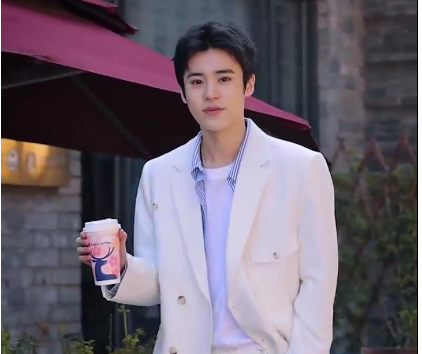

# 🕵️ Low-quality DeepFake Detection Dataset

A high-quality, multi-source dataset for training and evaluating **DeepFake detection** models, especially under **low-quality and compressed video conditions**.

---

## 🧠 Overview

This dataset is specifically constructed for training and benchmarking DeepFake detection algorithms. It contains short video clips generated by various cutting-edge methods, such as:

- **Open-Sora** based multimodal synthesis
- **FaceSwap** and **expression transfer**
- **StableDiffusion** enhanced DeepFake generation
- **FakeFormer** (transformer-based fakes)

All videos are subsequently **compressed** under different settings to simulate **real-world challenges** (low bitrate, resolution drop, codec artifacts, etc.).

---

## 📦 Dataset Composition

### 🔢 **Scale & Format**

| Metric            | Value                        |
|-------------------|------------------------------|
| Total videos      | 5000+                        |
| Duration/video    | ~15 seconds                  |
| Video format      | `.mp4`                       |
| Resolution        | 720p / 480p / 360p           |
| Size range        | ~1MB – 35MB                  |
| Compression type  | H.264, bitrate-limited, lossy|

📁 **Example File List**  
Each file is named with a unique timestamp-style ID (e.g., `1570235900–1–30032.mp4`) to indicate its creation source and type.

### 🧬 **Class Distribution**

- **Real videos**: ~1000, mostly crawled from **Bilibili** and **YouTube**.
- **Fake videos**: ~4000, generated using different DeepFake pipelines and subjected to various post-processings.
### 🎭 Real vs Fake Samples
 
### 🧪 Compression & Quality Settings

We simulate real-world video sharing platforms by applying:

- Bitrate throttling (e.g., 800kbps, 500kbps, 200kbps)
- Resolution downsampling (e.g., 720p → 480p)
- Codec-based artifacts using FFMPEG


---

## 🧰 Quick Usage

Download the sample dataset via the Baidu Disk link below and load with OpenCV:

```python
import cv2

cap = cv2.VideoCapture("sample_data/1570235900–1–30032.mp4")

while cap.isOpened():
    ret, frame = cap.read()
    if not ret:
        break
    # process the frame
cap.release()
```

## 😊 Contact Us
If you have any suggestions, comments, wish to contribute code or propose method, or if you with to obtain the complete dataset, please contact us at meiyi_w@126.com. Here is a small sample.
<br>The following is shared by the baidu disk
<br>链接：https://pan.baidu.com/s/1w6AsBWXqobkt4clwbkTjWQ 提取码:qaf3
